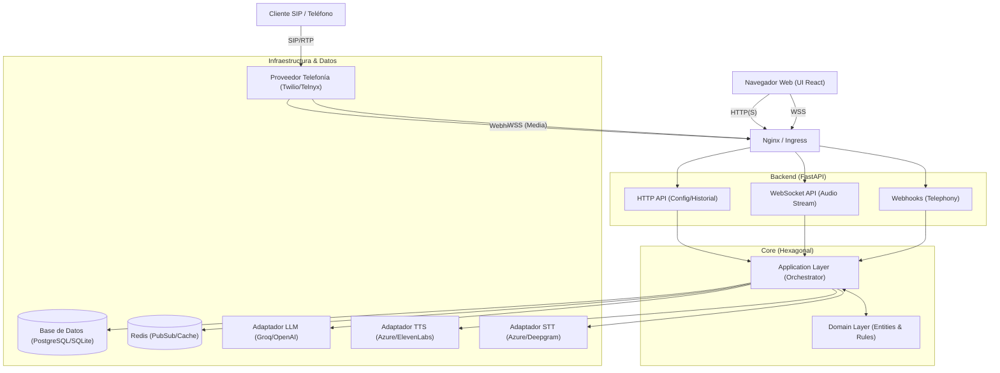
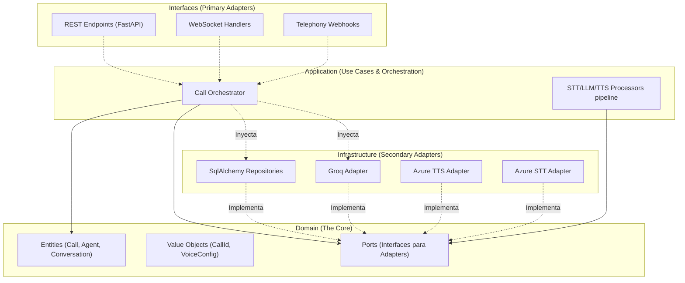
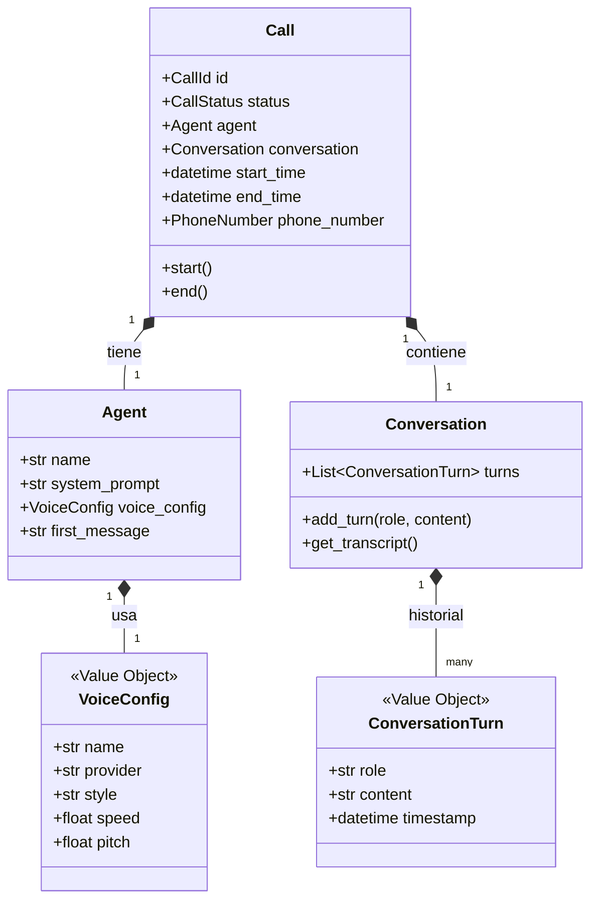
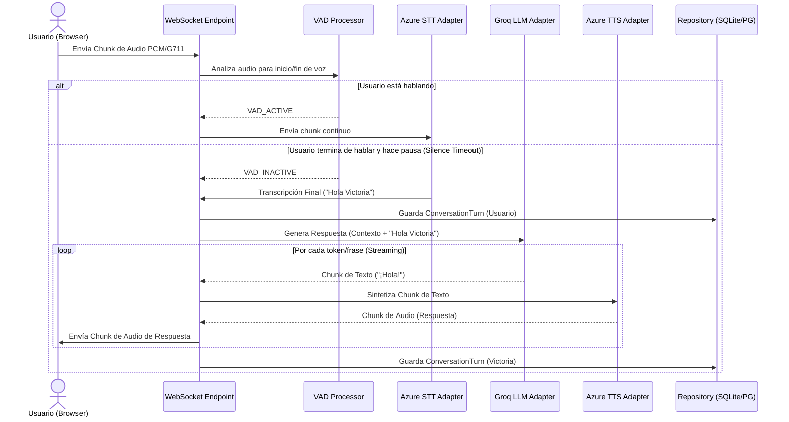
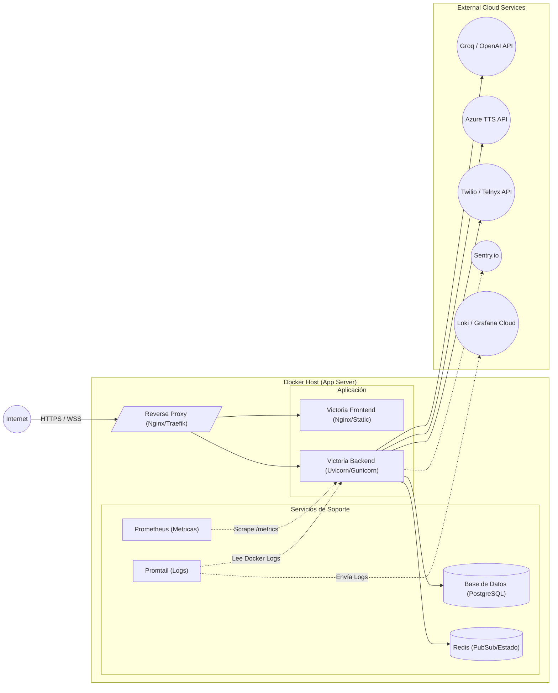

# Planos Maestros de Arquitectura - Victoria Voice Orchestrator

Este documento contiene los planos detallados (blueprints) de la arquitectura del sistema Victoria, representados mediante diagramas Mermaid y descripciones estructurales.

## 1. Topología del Sistema (Vista de Alto Nivel)

El sistema Victoria se compone de una interfaz de usuario en React (Frontend) que interactúa con un Backend en Python. El Backend orquesta múltiples servicios de IA y telefonía.

## 2. Arquitectura Hexagonal (Backend Core)

El patrón de Puertos y Adaptadores garantiza que el Dominio (Core) no tenga dependencias de frameworks técnicos.

## 3. Modelo de Dominio (Entidades Principales)

Representación conceptual de las entidades y su relación en el dominio.

## 4. Flujo de Datos Dinámico (Ejemplo: WebSocket Streaming Pipeline)

Este diagrama de secuencia ilustra cómo fluyen los datos de audio a través de los procesadores en una llamada browser-based a través del `CallOrchestrator`.

## 5. Topología de Despliegue (Production Docker Compose)

Arquitectura física de contenedores sugerida para un entorno productivo como un VPS o instancia Cloud.

